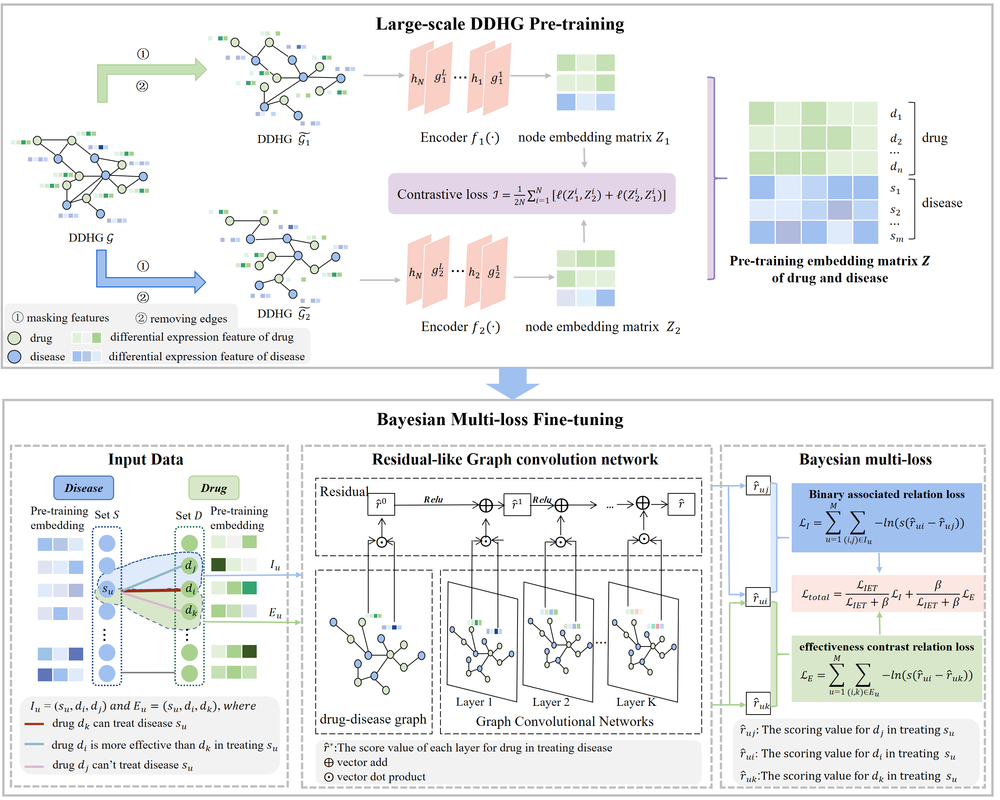

# DrugRepPT: a deep pre-training and fine-tuning framework for drug repositioning based on drug’s expression perturbation and treatment effectiveness 
## 1. Introduction
This repository contains source code and datasets for the paper "DrugRepPT: a deep pre-training and fine-tuning framework for drug repositioning based on drug’s expression perturbation and treatment effectiveness". In this study, we proposed a deep pre-training and fine-tuning framework for drug repositioning. First, we design a graph pre-training module with model-augmented contrastive learning on a large drug-disease heterogeneous graph, to capture the rich features of intricate interactions and expression perturbation after intervention. We introduce a fine-tuning module of graph residual-like convolution network to capture sophisticated interactions among diseases and drugs, and a Bayesian multi-loss to effectively equilibrate both existence and effectiveness contrast of drug treatment.
## 2. Overview

## 3. Install Python libraries needed
```
$ conda create -n DrugRepPT_envs python=3.9
$ conda activate DrugRepPT_envs
$ pip install -r requirements.txt
```
## 4. Methods
The graph pre-training module uses graph contrast learning code from [MA-GCL](https://github.com/GXM1141/MA-GCL), and the fine-tuning module uses graph residual-like convolution network from [LR-GCCF](https://github.com/newlei/LR-GCCF).
### 4.1 Pre-training of large-scale DDHG
#### 4.1.1 Dataset
- input_data.xlsx: Differential gene expression features of drugs and diseases.
#### 4.1.2 Running
```
nohup python -u main.py --device 'cuda:0' --config 'param.yaml' --seed 0 --input_file '../data/Pre-training/input_data.xlsx' --fea_type CMap features --output_features_file '../data/Fine-tuning/' > Pre-training.txt 2>&1 &
```
- --device: cuda device, i.e. 0 or 0,1,2,3 or CPU.
- --config:save parameters, including learning_rate, etc.
- --seed: random seed. 
- --input_file: differential gene expression features.
- --fea_type: node feature type, i.e. 'CMap features', 'random features'.
- --output_features_file: output embedding features of drugs and diseases from CL pre-training.
### 4.2 Bayesian Multi-loss Fine-tuning for drug repositioning
#### 4.2.1 Dataset
* datanpy
  * training_set.npy: training dataset
  * testing_set.npy: test dataset
* node_features
  * CMap_CL_features
    * Graph_embeddingfull.npy: The features from gene expression and contrast learning pre-training for diseases and drugs.
  * random+CL features
    * Graph_embeddingfull_ranfea_512.npy: The features from random initialization and contrast learning pre-training for diseases and drugs.
  * CMap_features.xlsx: The features from gene expression for diseases and drugs.
  * ran_features.xlsx: The features from random initialization for diseases and drugs.
* train_test.xlsx: The drug-disease relationships into the training and test set according to the ratio of 8:2.
#### 4.2.2 Running
```
nohup python -u main.py --lr 0.1 --epoch 350 --input_fea_dim 512 --batch_size 2048 * 512 --beta 1e-03 --user_num 262 --item_num 363 --datanpy '../data/Fine-tuning/datanpy/' --features_type 'CMap+CL features' --init_features_file '../data/Fine-tuning/node_features/CMap_CL_features/Graph_embeddingfull.npy' --input_train_test '../data/Fine-tuning/train_test.xlsx' --run_id 'CL512_lr_01_pn_new_rank_beta1e_03_bs2048_512_l3_relu_' --run_id_path 'fea/all_0.5' --circle_time 10 > Pre-training.txt 2>&1 &
```
- --lr: learning rate.
- --epoch: training epochs.
- --input_fea_dim: dimension of the input feature.
- --batch_size: the size of each batch.
- --beta: position-aware weight.
- --user_num: number of diseases.
- --item_num: number of drug.
- --datanpy: the path to the .npy file.
- --features_type: the drugs and diseases features type of the input fine-tuning model
- --init_features_file: the drugs and diseases features the path of the input fine-tuning model
- --input_train_test: training dataset and test dataset files.
- --run_id: model save path.
- --run_id: cycle number.

  
